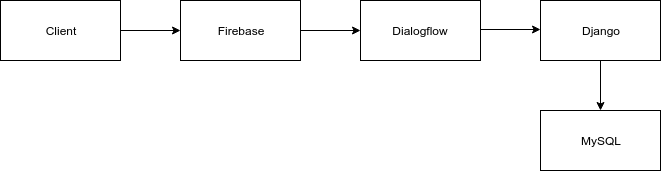

# Application Architecure

The application architecture will be explained below. There will be a diagram at the end to show it
in action. The reasoning behind every step will also be given.

Please keep in mind, everything can be improved, so do not think of this as the Holy Grail or anything of the sort.

### The client (browser)
The user will be presented will be a simple chat button on the bottom right of the page.
Clicking this button will cause the chat window to open, and the bot will initiate the conversation with some information.

The user will then get the option to input whatever they please, and then send it.

The client will take this input and send it to a Firebase function. This function will be explained below. Then the client
waits on the function to return a textual response as well as status code.

It is necessary to send it to the function (or some other sort of backend) because this is safer than sending it directly to DialogFlow.
It does not expose any sensitive information or link.

### Firebase function
The Firebase function will receive the data from the frontend, which will be the user's query/text. This function will send
it to DialogFlow using the API and then wait on DialogFlow to parse and return all information about that query. Then this function
will return the textual response as well as a status code to the client to indicate if the response should be handled in a specific manner.

This is done with a Firebase function because we were initially guided towards Firebase. The function was easy and quick 
to create for a demo for the clients and we stuck with it. However, we noticed that the other offerings of Firebase would not 
suit us entirely (it is limited for the free plan) and so we moved away from it. Now, we only use the one function.

This could be improved by removing the function and implementing it in the Django backend. We just did not have the time to
do such a serious refactor.

### DialogFlow
DialogFlow will receive the textual input from the function and try to determine its intent. It tries to match it towards the many
intents that it already has. Once it does, it will send all of its data to the webhook url specified in the agent settings.

The webhook url is basically the Django server that listens for any call to ```/webhook/```.

DialogFlow was used because no one on the team had any experience with building chatbots or training a model with data. This
is a massive task, and for the time that we had, we would not have had been able to do it. We got guidance from Dr. Jeff Dalton
at the University for both DialogFlow and Firebase.

### Django Server
As mentioned above, the Django server listens on one url route. It takes in the data and tries to extracts the necessary information.

If it cannot or if the request is malformed, then it tries to handle it accordingly. If it gets the data that it needs, 
it sends to the method ```handle()``` in the ```intent_handler``` file. The handle method will determine which method in turn within it
to call to handle the data. The internal methods make the call to the database to look for what the user wants, and then returns it.

Once the database returns the data, the ```handle()``` method will return that data back to the view handler, which will return it
as a JSON response to DialogFlow, which will then return it to the Firebase function, which will then return it to the client, 
and finally display the response to the user. All in all, this happens very rapidly, but not rapidly enough. The user will feel
more comfortable talking to a chatbot with delayed responses, much like how a real person would not have instant responses.

Django was used because it has an incredible admin page and is easy to set up and work in. Initially, we were using Flask, because
we had found a nice tutorial online on using it with DialogFlow and stuck with it. It actually worked quite nicely up until we 
needed the admin page. All in all, setting up Django took less time than it would have to set up just the admin page on Flask. So stick with Django.


### Diagram of all this in action

